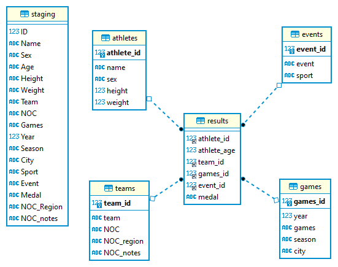

# Olympic SQL Challenge
A SQL Portfolio challenge, setup a database, upload and optimise a dataset, analyse and create a visualisation. 


## Task Overview
- [Part 1: Setup a mySQL database :inbox_tray:]( )
- [Part 2: Upload a dataset :crystal_ball:]( )
- [Part 3: Optimise the data :chart_with_upwards_trend:]( )
- [Part 4: Analysis and visulisation :chart_with_upwards_trend:]( )
- [Part 5: Record the project on GitHub :white_check_mark:]( )


## Part 1: Setup a mySQL database :inbox_tray:

Before we write any SQL we're going to need a database. For this challenge we'll be using mySQL

### Key Steps:

- Install mySQL locally: [https://dev.mysql.com/doc/mysql-getting-started/en/#mysql-getting-started-installing](https://dev.mysql.com/doc/mysql-getting-started/en/#mysql-getting-started-installing)
- In the installer select the "Full" version, you will need the SQL Server and mySQL Workbench
- Set yourself up as a database admin and enter a password - you will need this when you log in
- Open mySQL Workbench, login, familarise yourself with the mySQL interface and find the databases on the server

- If you have any issues there's a quick walkthrough here:
[https://www.youtube.com/watch?v=YSOY_NyOg40](https://www.youtube.com/watch?v=YSOY_NyOg40)


## Part 2: Upload a dataset :inbox_tray:

In this challenge we'll be working with data from the Summer Olympic Games, you can find the [data here](https://github.com/wjsutton/SQL_olympics/blob/main/olympics_data.csv). <br>Originally sourced from: [Kaggle](https://www.kaggle.com/datasets/bhanupratapbiswas/olympic-data?select=dataset_olympics.csv)

### Key Steps

#### 1. Create Your Database/Schema

In mySQL there is no visual difference between a schema and a database.

For the full path of a table you make be used to the convention of:
- database.schema.table 

but here you can use either:
- database.table
- schema.table

Hint: Use the CREATE SCHEMA command to create a schema, or CREATE DATABASE for a database.

```
CREATE DATABASE olympics;
-- Or use CREATE SCHEMA olympics;
USE olympics;
```
Note the USE will set our path to be a given database or schema.

#### 2. Create a Staging Table

At this point we just want the data on our SQL Server, and we'll improve it later.

Using details of our [data](https://github.com/wjsutton/SQL_olympics/blob/main/olympics_data.csv) create a table for this data to fit into.

Hint: In your created database/schema use the CREATE TABLE command to build a table, e.g.

```
CREATE TABLE mytable (
  col1 INT,
  col2 INT,
  col3 VARCHAR(10),
  col4 VARCHAR(200)
);
```
Note here the datatypes are import to label correctly identify numerical data vs text data, however the specific accuracy of the datatypes is less important, e.g. VARCHAR(255) vs VARCHAR(50) - we will fix this later. 

Tools like  [konbert.com/convert/csv/to/sql](https://konbert.com/convert/csv/to/sql?) can help you structure this create table statement.

#### 3. Insert Data

To put our data on mySQL we will be uploading the raw values via an INSERT VALUES statement. i.e.

```
INSERT INTO mytable VALUES
(1,2,'a','b'),
(....)
```

To get the data into this type of format, you can use a tool that converts CSV to SQL, personally I recommend [konbert.com/convert/csv/to/sql](https://konbert.com/convert/csv/to/sql?) due to the file size of this challenge.

### Deliverable

1. A database or schema containing a table with the [data found here](https://github.com/wjsutton/SQL_olympics/blob/main/olympics_data.csv)

### My Solution

- [Create Database and Staging Table](https://raw.githubusercontent.com/wjsutton/SQL_olympics/main/sql/create_database.sql)
- [Insert Data](https://raw.githubusercontent.com/wjsutton/SQL_olympics/main/sql/insert_raw_data.sql)

## Part 3: Optimise the data :chart_with_upwards_trend:

Looking at our data, it can be stored in a more efficient way. In this section we'll look to take data from our staging table from part 2 and convert it to smaller tables on specific themes. 

Doing this will reduce storage costs, increase query performance and reduce any bottleneck from querying a single table.   

### Key Steps

#### 1. Plan Your Tables

Looking at the data there are a few common themes we can see:
- Details about the athletes, their ages, height, weight
- Details about the teams, the NOC and region
- Details about the games, when and where the games were held
- Details about the results, the event, the competitors and the medals

For this dataset we'll look to implement a Star Schema design with:
- Our Fact Table: results
- Our Dimension Tables: athletes, teams, games
- More details on Star Schemas https://learn.microsoft.com/en-us/power-bi/guidance/star-schema

#### 2. Deciding on Columns

When restructuring your table the goal is to make every row unique for that id.

For example for our athletes, we don't want the same athlete appearing multiple times as this we cause problems when we join tables together.

Start with SELECT DISTINCT and build in additional columns, e.g. Here I'm seeing if each athlete has a unique name

```
SELECT DISTINCT
id,
name
FROM staging;
```

And we can varify this with a COUNT and HAVING clause:

```
SELECT
id,
COUNT(DISTINCT name) as names
FROM staging
GROUP BY id
HAVING COUNT(DISTINCT name)>1;
```
Which returns zero results, meaning there are now ids with different names. 

However if we carry on further to ages, we'll see we have multiple for athletes.

```
SELECT
id,
name,
sex, 
COUNT(DISTINCT age) as ages
FROM staging
GROUP BY id, name,
sex
HAVING COUNT(DISTINCT age)>1;
```

Rather than store the athlete's age at the point of the competition which will change, we could instead store their year of birth and we can recalculate their age using the year of the games.

However this still returns multiple values, as the date of the games happens at different times of the year, in this case I will leave the age of the competitor in the fact table as it varies by competitor and year of the games. 

#### 3. Creating ID Columns

Id columns are regularly used with each table in SQL as they are easy for SQL to join on and take up less storage space than text objects.

In mySQL we can find the data required for the teams dimension table using 

```
SELECT DISTINCT 
team,
noc,
noc_region,
NOC_notes
FROM staging
```
However there's no ID field, meaning we'd have to join on the team name. 

That is unless we create a column to be our ID, for this we'll use the ROW_NUMBER() function. 

However if you add ROW_NUMBER() to this query you'll find we have the same data repeated multiple times with different IDs

```
SELECT DISTINCT 
ROW_NUMBER() OVER(ORDER BY team) as team_id,
team,
noc,
noc_region,
NOC_notes
FROM staging
```

What we need to to run our SELECT DISTINCT to find the data we need, then give it an ID. Typically you could do this using a Common Table Expression (CTE) or a Subquery, in this case I will use a Subquery as historically mySQL cannot run CTEs, however they now can as of version 8, you can check your version by running `SELECT version();`

Rewriting my query using a Subquery

```
SELECT 
ROW_NUMBER() OVER(ORDER BY team) as team_id,
team,
noc,
noc_region,
NOC_notes
FROM (
	SELECT DISTINCT 
	team,
	noc,
	noc_region,
	NOC_notes
	FROM staging
) as teams;
```

#### 4. Create Tables and Insert Data

Based on the above we need to create the tables:
- results (Fact table)
- athletes (Dimension table)
- teams (Dimension table)
- games (Dimension table)
- events (Dimension table)

As before we can use the CREATE TABLE command to build a table, e.g.

```
CREATE TABLE mytable (
  col1 INT,
  col2 INT,
  col3 VARCHAR(10),
  col4 VARCHAR(200)
);
```
And we can check column sizes using:

```
SELECT
MAX(LENGTH(name)),
MAX(LENGTH(sex)),
MAX(LENGTH(team)),
MAX(LENGTH(noc)),
MAX(LENGTH(noc_region)),
MAX(LENGTH(NOC_notes)),
MAX(LENGTH(event)),
MAX(LENGTH(city)),
MAX(LENGTH(season)),
MAX(LENGTH(sport)),
MAX(LENGTH(games)),
MAX(LENGTH(medal))
FROM olympics.staging;
```

All IDs should be stored as INT.


#### 5. Set Primary and Foreign Keys

Each of your dimension tables should be set to have a Primary Key.
The results table will contain Foreign Keys from your dimension tables.

For example,

```
-- Add primary key
ALTER TABLE athletes ADD PRIMARY KEY(athlete_id);

-- Add foreign key
ALTER TABLE results ADD FOREIGN KEY (athlete_id) REFERENCES athletes(athlete_id);
```

#### 6. Create ER Diagram:
Once your tables are built, populated, and linked, download and use [DBeaver](https://dbeaver.io/) to create an ER diagram to visualize the relationships between your tables.

**Key Steps**
- Download [DBeaver](https://dbeaver.io/)
- Create connection > SQL > MySQL (Version 8+)
- Server Host: localhost
- Port: 3306
- Username: root
- Password: your database password
- Finish

You should see your database and the tables within it. 

Select each table > right click > Create New ER Diagram



### Deliverable

At the end of this section, you should have:
- a collection of tables in a mySQL database/schema with tables populated with Olympics data.
- a SQL script creating your taking data from your staging table, creating tables, inserting data and creating primary and foreign keys
- a DBeaver ER diagram showing the relationships between your tables

### My Solution

Here is my solution if you get stuck
- [SQL - Create Database and Staging Table](sql/create_database.sql)
- [SQL - Insert data into Staging Table](sql/insert_raw_data.sql)
- [SQL - Check Column Sizes](sql/check_column_size.sql)
- [SQL - Create New Tables and Keys](sql/restructure_data.sql)
- [ER Diagram](olympic_erd.png)

Of note, Database/Schema design does have a reasonable amount of subjectivity to it, the solution I have will improve upon having just one table but there may be a more optimised solution depending on how your data will be used. 

## Part 4: Analysis and visulisation :chart_with_upwards_trend:

Now we have our data prepared it's time to run some analysis. You could look at:
- The rise and fall of nations in the medal league tables 
- Do physical attributes (height, weight) matter for medals? In weight sports does height/weight matter? 
- Home advantage, if your city hosts the Olympic Games is your nation more likely to outperform in the medal tables?

If want to stick to a tutorial you can follow my project, recreating my Running for [Olympic Gold viz](https://public.tableau.com/app/profile/wjsutton/viz/RunningforOlympicGold/RunningforOlympicGold). 


### Key Steps

#### 1. Query the new schema

For this output we'll need:
- all gold medalists
- columns for region, year, event, sport, gender
- one row for each medal result (note team sports have multiple medals, we'll count those as 1 medal)

For this viz I'd filtered to running events, but you could pick a sport you're interested in, or leave that up to the user via a filter.

#### 2. Save the result as a table

As before we can use the create table command
```
CREATE TABLE my_viz AS
SELECT DISTINCT
...
FROM results as r
...
```

#### 3. Connect your data to Tableau Desktop or download the result as a csv for Tableau Public

On Tableau Desktp you may need to download an additional driver but will be able to connect with the same details as used for DBeaver.

#### 4. Add Continent lookup

The csv file here [Countries-Continents.csv](https://github.com/dbouquin/IS_608/blob/master/NanosatDB_munging/Countries-Continents.csv) will allow you to join country names to continents for the color scheme

#### 5. Design the dashboard

For this viz I've built a rectangluar view, however you may want to try something more adventurous like [Olympic feathers by Nadieh Bremer](https://www.visualcinnamon.com/portfolio/olympic-feathers/) you can try the [Radial Heatmap Generator](https://github.com/wjsutton/radial_heatmap_generator) I've built. Do give Nadieh Bremer reference as "recreated from Nadieh Bremer's Olympic feathers.


Save your viz to Tableau Public and share it with #SportsVizSunday

### My Solution
Here is my solution if you get stuck:
- SQL Script: [Create Results Table](sql/create_results_table.sql)
- Downloadable Tableau Dashboard: [Olympic Gold viz](https://public.tableau.com/app/profile/wjsutton/viz/RunningforOlympicGold/RunningforOlympicGold)

## Part 5: Record the project on GitHub :white_check_mark:

If you haven't already please sign up to GitHub first at [https://github.com/join](https://github.com/join) and watch this intro video [Git, GitHub, & GitHub Desktop for beginners](https://www.youtube.com/watch?v=8Dd7KRpKeaE)

Create a repository: 
- Create a New repository for this analysis (something like "Olympic-SQL-Analysis")
- Select the visibility as 'Public'
- Initialize the repository with a README

Add files to your repository

Please ensure any files, notes, in fact, anything you put on GitHub does not have any passwords or login information. If you do this view the login as compromised, please delete the repo and create a new password/login.

On Github.com on your repository click on 'Add file' > 'Upload files' and upload your:
- SQL scripts,
- Schema Diagram,
- solution csv

Edit your README.md

GitHub provides a readme file which is rendered when a user views your repository, it's a great way to document your project and looks great for a portfolio project, like this one. 

Please copy and paste the [template_readme.md](https://github.com/wjsutton/lego_analysis_challenge/blob/main/template_readme.md) and update the links and details about your project.

Note the readme file must be called "README.md" to appear on rendered on the repository home page.
